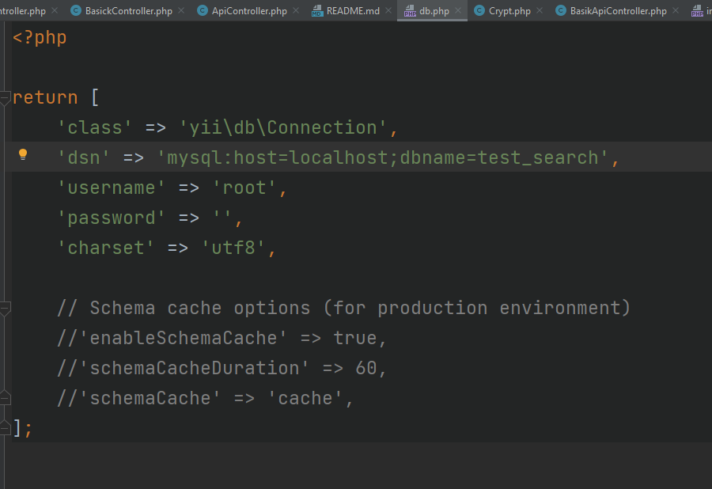
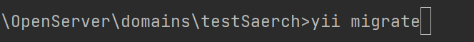
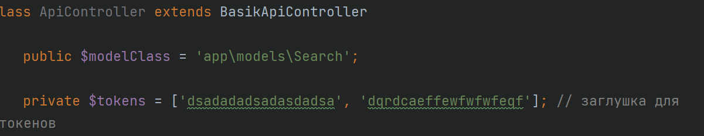
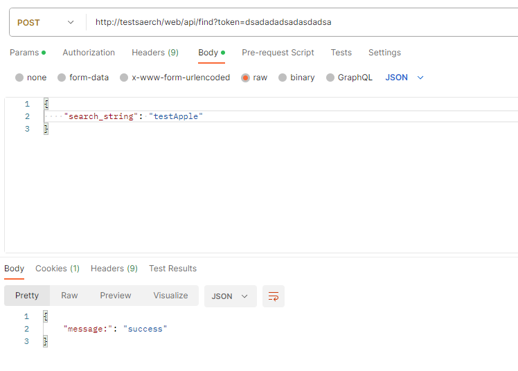
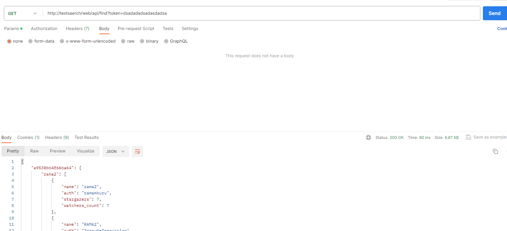
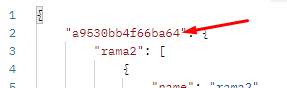
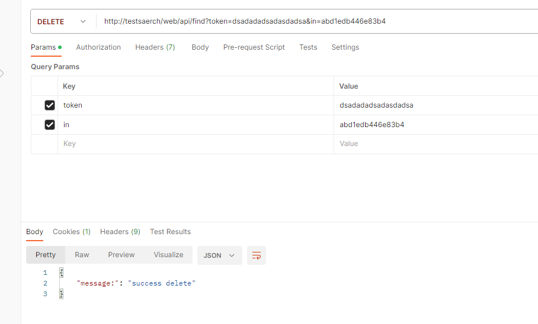

для работы проекта не обходимо создать бд
с кадеровкой utf8_general_ci

точка входа в папке web index.php

нужно преминить миграцию

нужная нам страничка
http://testsaerch/web/search/search-project

работа с API авторизацию сделана временная для демонтсрации работы
токены в ApiController

запросы (примеры)
post принимает только RawBody

get

delete парметр in - это индефикатор конкретного поиска 

сам запрос

